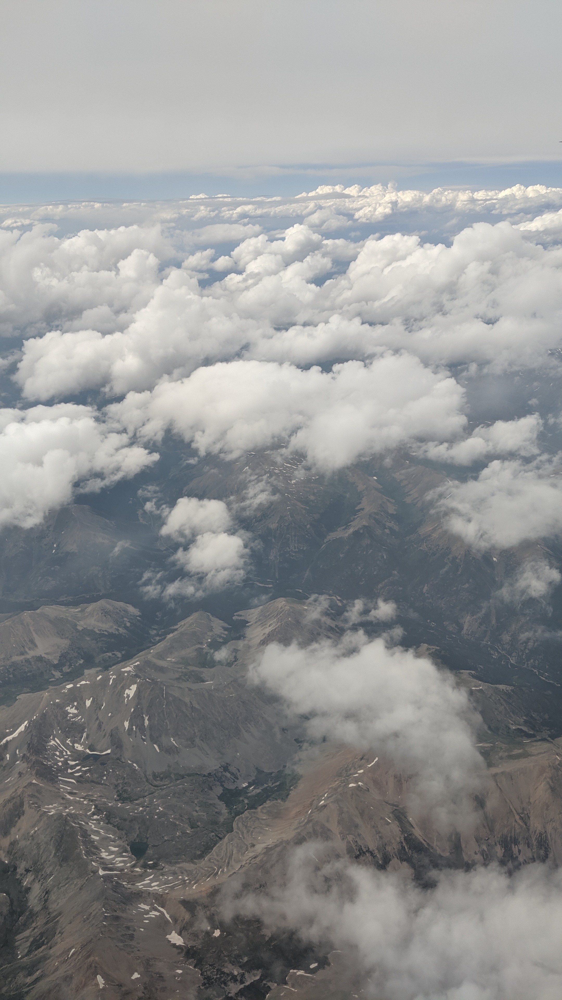

## In flight
Headed towards my future, unwittingly.  

## On the ground
I'd never been to South Dakota before. My family was here to visit an unassuming college in the small town of Madison - Dakota State University.
 
 
My brother had chosen this college for it's strength in cyber security. At the time, I was quite ignorant of the field. I was too busy lining up my ducks for medical school.
 
 
_Get into biology research at UCSD_
 
_Finish psychology degree_
 
_Take the MCAT at the end of this year_
 
_Complete Pathmaker Internship_
 
_Maintain 4.0_
 
_Begin working at senior care home_
 
 
I was quite prepared. I even had my application timeline refined by a friend starting residency.
 
 
So I toured the campus with an air of indifference, caring only about what my brother thought and refraining from forming any opinions of my own. After all, it was not the college _I'd_ be attending.
## Back home
By this time next year, I would be attending Dakota State University, majoring in cyber security, and already Security+ certified - my neat row of ducks abandoned.
 
 
I soon learned that the difficulty of medicine was not in the knowledge required to master it. After working at the senior care home (one of my steps in curating my med school application), I realized that I could not balance caring about my patients and simultaneously preventing myself from caring so that their suffering would not haunt my sleep.
 
 
I was unable to separate myself from the pain of others, even for the greater good. I still struggle with this fact, but ultimately understand that had I stayed in the medical field, I would've burnt out rather quickly and would not have been able to care for my patients to the best of my ability. So I left, choosing to pursue a path that would allow me to help others without hurting myself.
 
_I still wonder if this makes me weak, or if I am stronger for having recognized my weakness and stepping down before it was too late..._
## A new campus
I have not been to Dakota State University since enrolling. With covid-19 raging through the U.S., the campus has remained unknown to me. If I ever visit again, I doubt it will look the same as it did when I was simply a tourist instead of a student.
